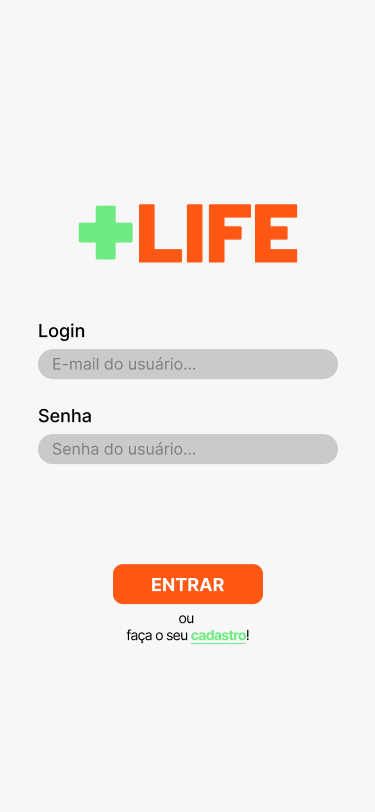
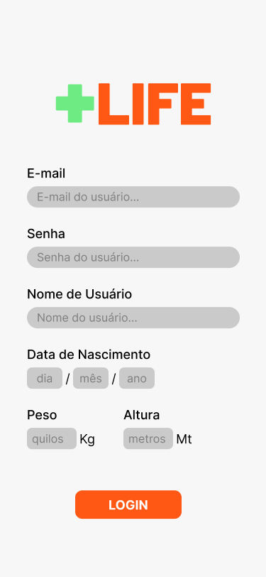
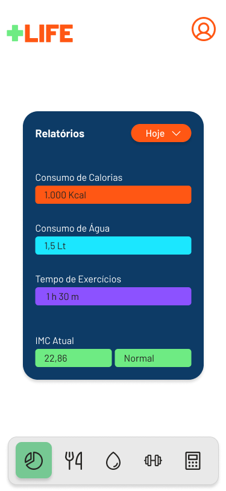
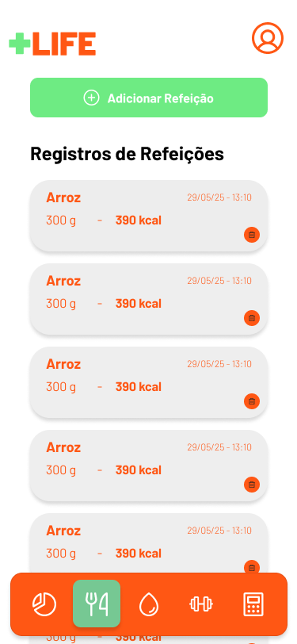
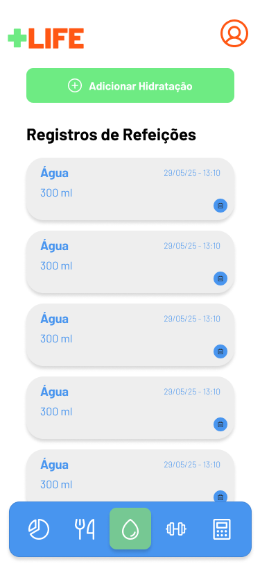
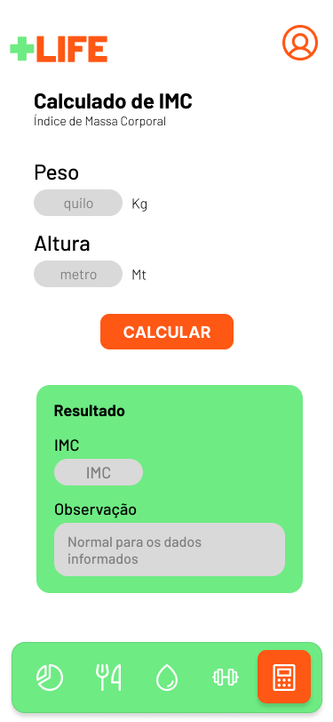
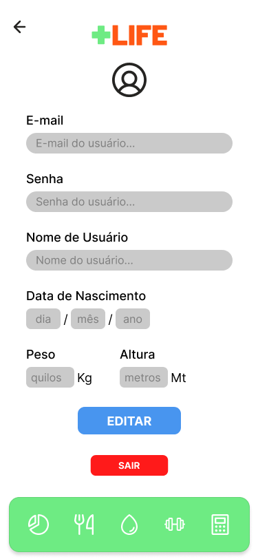

Links de Acesso:

[Sobre o App](#pluslife) | [Como rodar o projeto](#como-rodar-o-projeto) | [Tecnologias utilizadas](#tecnologias_utilizadas)

---

 
 

# ➕💚 PlusLife 

O PlusLife é um aplicativo móvel desenvolvido para auxiliar usuários a monitorar e manter um estilo de vida saudável, registrando atividades físicas, alimentação e hidratação. Ele oferece as seguintes funcionalidades (Requisitos Funcionais):
- [RF1] O sistema deve manter usuários.
- [RF2] O sistema deve manter registros de refeições do usuário.
- [RF3] O sistema deve manter registros de hidratação do usuário.
- [RF4] O sistema deve manter registros de exercícios do usuário.
- [RF5] O sistema deve calcular IMC (Indice de massa corporal).

 

## 🏃‍♂ Possui as seguintes telas:

  

    
Login

    
  

  

    
Cadastro de Usuário

    
  

  

    
Home Page/Dashboard

    
  

  

    
Registros de Refeições

    
  

  

    
Registros de Hidratações

    
  

  

    
Registros de Exercícios

    
  

  

    
Calculadora de IMC

    
  

  
  

    
Perfil do Usuário

    
  

 
 

# 🤓 Como rodar o projeto?

Para executar o *PlusLife* em sua máquina, siga os passos abaixo:

1.  *Clone o Repositório:*
    Abra seu terminal ou prompt de comando e execute:
    bash
    git clone [https://github.com/JoaoVictor-Noschang/pdmii_projeto_disciplina.git](https://github.com/JoaoVictor-Noschang/pdmii_projeto_disciplina.git)
    
     

2.  *Instale as Dependências:*
    Navegue até o diretório do projeto clonado e instale todas as dependências necessárias com:

    Abrindo a página do projeto
    bash
    cd pdmii_projeto_disciplina
    

    Instalando as dependências
    bash
    npm install
    

 

3.  *Inicie o Aplicativo:*
    Após a instalação das dependências, você pode iniciar o projeto com:
    bash
    npx expo start
    
    Este comando abrirá o Metro Bundler no seu terminal, onde você poderá escanear o QR code com o aplicativo Expo Go no seu celular ou usar um emulador.

 
 

# 💾 Tecnologia em Análise e Desenvolvimento de Sistemas

5° Semestre - IFMT Campus Campo Verde.  
Projeto para a Disciplina de *Programação de Dispositivos Móveis II*

---

### 💡 Autores
- [João Victor](https://github.com/JoaoVictor-Noschang)

 

## 🔧 Features mínimas

Além disso o sistema deve cumprir os seguinte requisitos:
- Possuir 5 telas;
- Possuir pelo menos 1 microsserviço;
- Possuir Persistência de dados (local, BD, nuvem, ou outro).

 
 

# 🖥 Tecnologias Utilizadas

Este projeto foi construído utilizando as seguintes tecnologias e bibliotecas:

* *React Native:* Framework para desenvolvimento de aplicativos móveis multiplataforma.
* *Expo Go:* Ferramenta que facilita o desenvolvimento, teste e implantação de aplicativos React Native.
* *Expo Router:* Biblioteca de roteamento baseada em arquivos para navegação entre as telas do aplicativo.
* *Expo SQLite:* Biblioteca que oferece acesso a um banco de dados local SQLite, utilizado para persistência de dados.
* *Figma:* Ferramenta de design utilizada para prototipagem e criação das interfaces do usuário.

 

## Bibliotecas do Expo

Foram utilizadas algumas bibliotecas nativas do Expo Go, os quais foram necessárias a instalação de suas dependências, estão descritas a seguir.

### Iniciando um projeto Expo GO em branco com JS

1. Para iniciar o projeto em branco utilizando JavaScript, utilizou-se o comando de criação de projeto do Expo a partitr de um template em branco:

   <pre><code>npx create-expo-app@latest --template</code></pre>
   
   Após o comando o terminar solicita que escolha qual template será usado, e então escolheu-se o tamplate:

   <pre><code>blank</code></pre>

   Ao escolher, irá finalizar a instalação e configuração dos arquivos do Expo Go com um projeto em branco.

2. Após, o projeto foi iniciado, para verificar se tudo foi instalado corretamente, e para configurar aplicativo do celular para a renderização do projeto.

   <pre><code>npx expo start</code></pre>

 

### Incluindo a biblioteca Expo Router ao projeto

É uma biblioteca de roteamento baseada em arquivos para React Native.
Será a biblioteca resposável por mapear e lidar com a navegação entre as páginas do projeto.

1. Para intalar no projeto utiliza-se o seguinte comando:

   <pre><code>npx expo install expo-router react-native-safe-area-context react-native-screens expo-linking expo-constants expo-status-bar</code></pre>

 

### Incluindo a biblioteca Expo SQLite ao projeto

Uma biblioteca que fornece acesso a um banco de dados que pode ser consultado por meio de uma API SQLite.
Responsável por fazer a comunicação entre aaplicação e um banco de dado local utilizando SQLite.

1. Para intalar no projeto utiliza-se o seguinte comando:

   <pre><code>npx expo install expo-sqlite</code></pre>

 

---